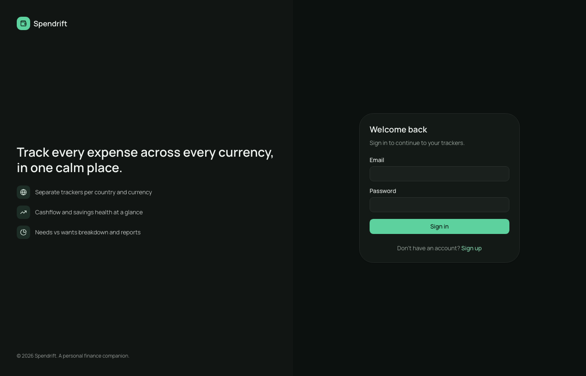
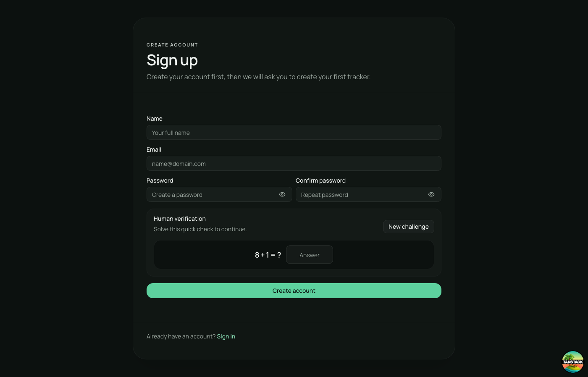
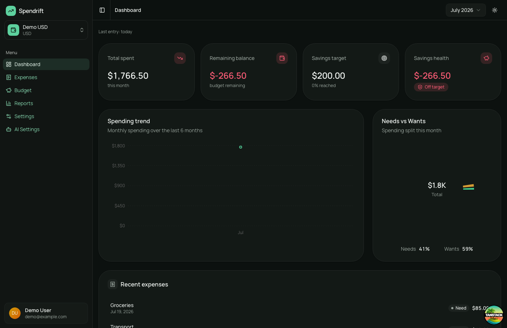
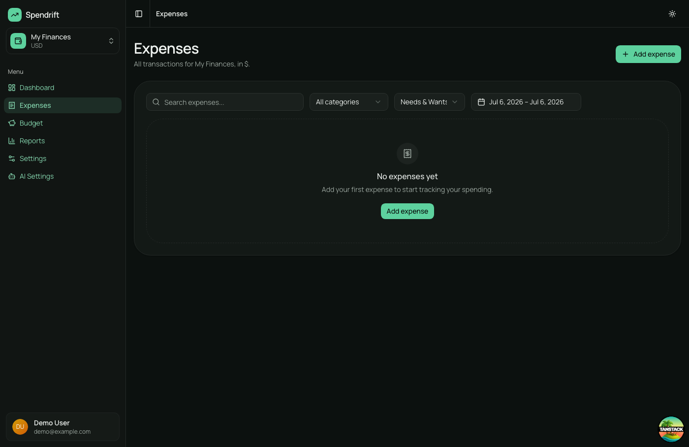
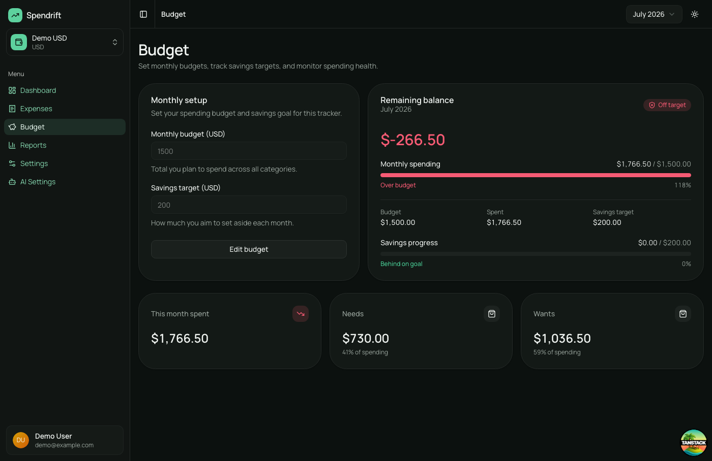
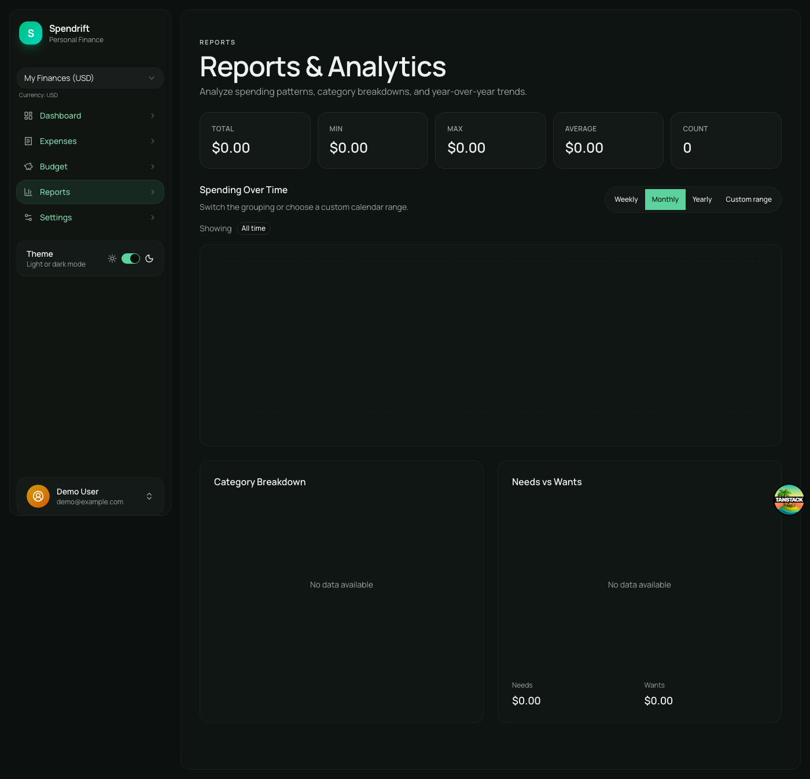
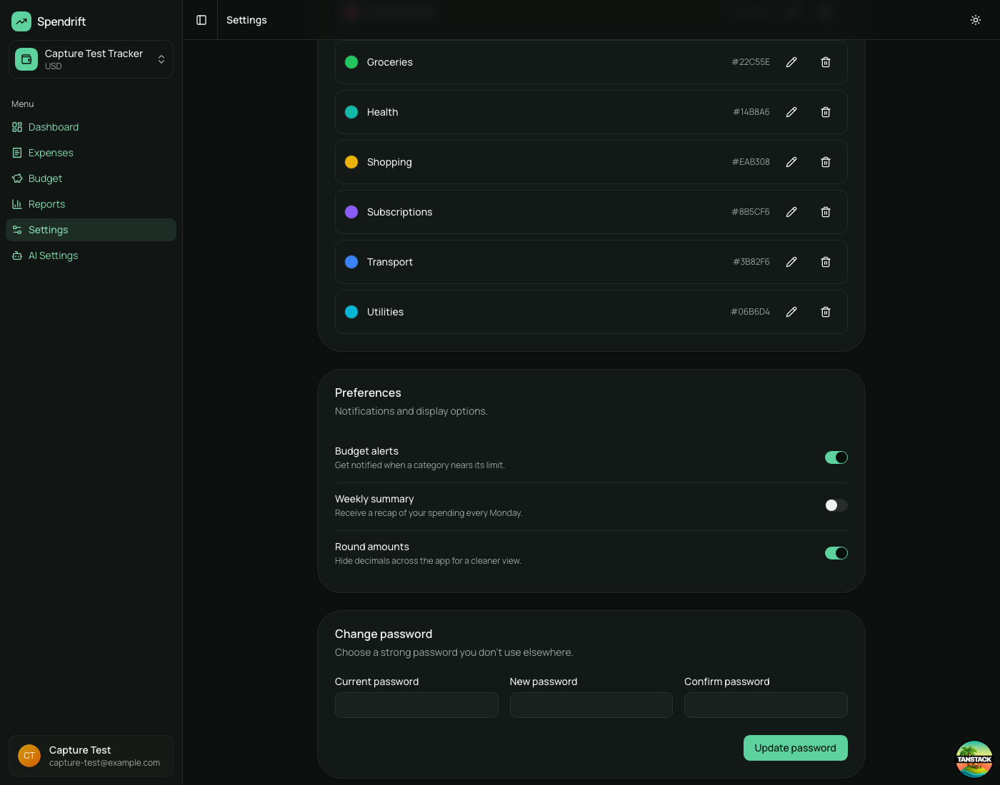

# 💰 Spendrift

A modern, minimal personal finance tracking application built with a focus on clarity, scalability, and AI-assisted development.

---

## 🚀 Overview

Spendrift helps users track:

- Daily expenses (Needs vs Wants)
- Monthly budgets and savings targets
- Financial reports (weekly / monthly / yearly)
- Multi-year spending comparisons
- Category breakdowns and analytics

The app is designed as a **tracker-based system**, where each tracker represents an independent financial workspace with its own currency (e.g., Bangladesh Tracker in BDT, Europe Tracker in EUR).

All features are backed by the real **Spendrift API** (FastAPI) — see [Getting Started](#-getting-started).

---

## 🧱 Tech Stack

- **TanStack Start** — full-stack React framework (SSR + file-based routing)
- **React + TypeScript**
- **TailwindCSS** + **ShadCN UI** (Radix primitives)
- **TanStack Query** — server-state, caching, and invalidation
- **Zod + React Hook Form** — schema validation
- **Recharts** (via ShadCN charts), **Sonner** (toasts)
- **Biome** — formatter + linter
- **Vitest** — unit tests
- **Sentry** — error monitoring

---

## ⚡ Getting Started

### Prerequisites

- **Node.js** 20+ and **pnpm**
- A running **Spendrift API** (FastAPI). The frontend expects it at `http://localhost:8000` with the base path `/api/v1`. Interactive API docs live at `http://localhost:8000/docs`.

### Setup

```bash
# 1. Install dependencies
pnpm install

# 2. Create your local env file
cp .env.example .env.local
# then set VITE_API_BASE_URL (default: http://localhost:8000/api/v1)

# 3. Start the dev server (http://localhost:3000)
pnpm dev
```

### Environment variables

| Variable | Required | Description |
|---|---|---|
| `VITE_API_BASE_URL` | ✅ | Base URL of the Spendrift API, **including** the `/api/v1` prefix. |
| `VITE_APP_TITLE` | optional | App title override. |
| `VITE_SENTRY_*` / `SENTRY_*` | optional | Sentry monitoring (see `.env.example`). |

### Scripts

```bash
pnpm dev      # start the dev server on :3000
pnpm test     # run the Vitest unit suite
pnpm check    # Biome lint + format check
pnpm build    # production build
pnpm start    # serve the production build
```

---

## 🏗️ Architecture

Spendrift follows a **Domain-Driven, Feature-Based Architecture**. Each feature is self-contained and split into three layers:

```text
src/features/<feature>/
 ├── domain/        # types + pure business logic (services.ts)
 ├── data/          # repository.ts (API calls), dto.ts (wire mapping), queryKeys.ts
 └── presentation/  # pages + React Query hooks (use*.ts)
```

### Data flow & the repository seam

Pages and hooks **never call `fetch` directly**. Every feature talks to the API through its `data/repository.ts`, which is the single swap seam:

```text
Page → presentation/use*.ts (TanStack Query) → data/repository.ts → shared/api/client.ts
```

Two impedance mismatches are handled at the `data/dto.ts` boundary so the domain stays clean:

- **Money** is a Decimal **string** on the wire (e.g. `"1267.42"`) ↔ `number` in the domain.
- **Casing**: API is `snake_case` ↔ domain is `camelCase`.

### Auth

JWT access + refresh tokens (stored in `localStorage`) with a single-flight **refresh-on-401** retry in `shared/api/client.ts`. Because tokens aren't readable during SSR, a client-side `WorkspaceGate` (in `routes/__root.tsx`) is the auth source of truth.

### Key principles

- Feature-based structure, cohesive domains
- Separation of UI from business logic
- Repositories as the single API seam
- Composition over abstraction; avoid premature optimization

---

## 🌍 Tracker System

Each tracker is an independent financial context with its own currency:

- 🇧🇩 Bangladesh Tracker (BDT)
- 🇪🇺 Europe Tracker (EUR)

Each tracker owns its expenses, categories, budgets, dashboard, and reports. The active tracker is carried in the URL as `?tracker=<id>`.

---

## 💸 Features

### Expense Tracking

- Add / edit / delete expenses
- Needs vs Wants tagging
- Search, date-range, type, and category filtering
- Per-category management (with safe "reassign to Uncategorized" on delete)

### Budgeting

- One budget per tracker per **current** month
- Monthly limit + savings target
- Remaining balance and a savings-health indicator (green / yellow / red)
- Previous months become read-only history
- **Per-category budget alerts** — a dismissible alert banner on the Dashboard
  surfaces categories that have crossed their warning / exceeded threshold for
  the selected month. Backend-driven (`GET /trackers/:id/budget-alerts`) and
  gated behind the user's "Budget alerts" preference.

### Dashboard

- Current-month spend, expense count, and budget remaining
- Needs-vs-Wants split and top categories
- Cashflow trend + recent expenses
- Honors the global month selector — pick a past month and every stat follows

### Reports

- Weekly / monthly / yearly spending
- Category breakdown and Needs-vs-Wants
- Year-over-year comparison
- Total / min / max / average analytics
- Custom calendar date ranges

### Preferences

Server-backed per-user toggles (`/preferences`):

- **Budget alerts** — enable/disable the dashboard alert banner
- **Weekly summary** — reserved flag (feature pending)
- **Round amounts** — round money display app-wide through `useFormatCurrency()`

The Settings page loads preferences via TanStack Query with optimistic updates
(rollback + toast on error).

---

## 📊 UI / UX Philosophy

Spendrift is designed to feel **minimal, calm, modern, and data-focused** — inspired by Linear, Notion, and modern fintech dashboards.

### Design principles

- Dark theme first
- High readability and clear hierarchy
- Meaningful colors (not decorative)
- Reduced visual noise

### Theme

An **emerald-forward** palette defined as `oklch` design tokens in `src/styles.css` (light and dark variants). The default is dark; a stored preference wins. Charts use ShadCN's chart components.

---

## 🧪 Testing

Unit tests cover the pure `domain/services` functions (budgets, expenses, reports) with **Vitest**:

```bash
pnpm test
```

Tests run in an isolated `vitest.config.ts` (node environment, `@/` alias) so they skip the full app plugin chain.

---

## 📁 Project Structure

```text
src/
 ├── features/          # dashboard, expenses, budgets, reports, trackers
 │   └── <feature>/     # domain/ · data/ · presentation/
 ├── shared/
 │   ├── api/           # apiFetch client + token storage
 │   ├── ui/            # shared UI (AppSidebar, StatCard, ThemeToggle…)
 │   ├── hooks/
 │   └── utils/
 ├── components/ui/     # ShadCN-generated primitives
 ├── routes/            # TanStack Start file-based routes
 └── styles.css
```

---

## 🔁 Development Workflow

1. Plan the feature structure first
2. Break it into small steps
3. Implement incrementally behind the repository seam
4. Verify (tests + run the app)
5. Commit using conventional commits

```text
feat(expenses): add expense list UI
fix(budget): correct remaining balance calculation
refactor(api): back reports with the real API
```

---

## 🤖 AI-Assisted Development

This project leans on AI for architecture planning, code explanation, UI exploration, and refactoring — used as **a mentor and assistant, not an autopilot**. The goal is *learning by building*, not blind generation.

---

## 🚧 Roadmap

- Investment tracking
- Loan management
- AI-powered financial insights
- Multi-user SaaS support
- Mobile optimization
- SSR auth via httpOnly cookies (currently a client-side gate)

---

## 🖼️ Screenshots

### Sign In



### Sign Up



### Dashboard

> Includes the (new) **Budget alerts banner** at the top — appears only when
> the user's `preferences.budgetAlerts` flag is enabled and the selected
> month has categories crossing the warning / exceeded threshold.



### Expense List



### Budget



### Reports



### Settings — Preferences

> The Preferences card is now backed by `GET/PUT /preferences` (no longer
> localStorage). Toggling instantly reflects everywhere `useFormatCurrency()`
> is used when **Round amounts** is on.



> 📸 To re-capture the screenshots in this section (e.g. after a UI pass),
> see [`docs/screenshots/CAPTURE.md`](docs/screenshots/CAPTURE.md) and run
> `pnpm dlx tsx scripts/capture-screenshots.ts`.

---

## 📜 License

Copyright (c) 2026 Dipto Karmakar

Licensed under the **GNU Affero General Public License v3.0 (AGPL-3.0)**.
See the [LICENSE](LICENSE) file for full terms.

**In plain English:**

- You may study and use this code for personal/educational purposes
- If you modify and distribute it, you must open-source your version under AGPL-3.0
- You may **not** use this in a commercial product or SaaS without written permission from the author
- You **must** credit the original author (Dipto Karmakar) in any derivative work

For commercial licensing inquiries: [diptokmk47@gmail.com](mailto:diptokmk47@gmail.com)

---

## ✨ Author

**Dipto Karmakar** — Frontend engineer focused on React / TypeScript, domain-driven design, high-performance UI, and AI-assisted workflows. Spendrift is a personal initiative to explore modern fintech UX and scalable SaaS architecture.
